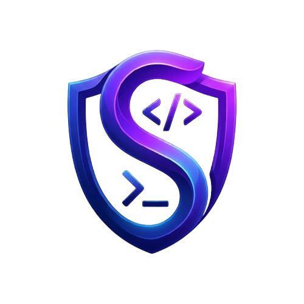

  
  
  <h1>Stavreng</h1>
  
  
<strong>The ultimate AI-Agent oversight and tracking extension for VS Code.</strong>

  
Stop letting CLI AI agents blindly overwrite your codebase. Stavreng gives you full transparency and granular control over every single line of code your AI tries to modify. It is especially powerful for users running Local LLMs, but is equally useful for tracking any standard CLI coding agent (like Claude Code, Aider, Cursor, etc.).

---

## ✨ Why Stavreng?
When you run a coding agent in a standard terminal, it edits your files directly on disk. If it makes a mistake, clobbers a recent change you made, or rewrites a function poorly, your only defense is digging through `git diff` manually or relying on massive `git undo` commands that wipe out your own manual work too.

Stavreng fixes this by intercepting those changes locally and treating them as **"Pending Proposals"**.

## 🚀 Key Features

*   **Integrated Agent Terminal UI:** Run `claude`, `agy`, `aider`, or any local LLM interactive CLI natively inside the Stavreng sidebar.
*   **Granular File Review & Diffing:** Click on any file in the "Pending" state within the Stavreng sidebar to instantly open a side-by-side diff. Compare the exact "baseline" state of the file before the AI touched it against the AI's live changes.
*   **Surgical Rollbacks (Hunk-by-Hunk):** Don't like a specific loop the AI wrote? Review the diff and click "Reject" to surgically roll back *just that code block* without losing the manual edits you made somewhere else in the file! (All accepts and rejects update the live editor in real-time).
*   **Session Timeline:** A visual, interactive history of every AI session. Safely open previous sessions to read chat logs or review past file modifications.

## 📦 Installation

Since this extension is currently in open-source beta, you can install it manually:

1.  Go to the [Releases](#) page of this GitHub repository.
2.  Download the latest `stavreng-x.x.x.vsix` file.
3.  Open VS Code, go to the **Extensions** panel.
4.  Click the `...` menu at the top right and select **Install from VSIX**.
5.  Select the downloaded file.

## 🎯 How to Use

1.  Open the Stavreng icon in your VS Code Activity Bar.
2.  In the terminal at the bottom, launch your favorite agent (e.g. type `claude` or run your local LLM CLI).
3.  Ask the AI to build something!
4.  As the AI modifies your files, you will see the changes tracked in the UI above the terminal as "Pending".
5.  Click a specific file to review the diff side-by-side. Use the **Accept All** (check) or **Reject All** (trash) buttons to approve or revert changes.
6.  When you are done, click **New Terminal** to safely clear the session and start fresh.

## 🤝 Contributing

We welcome open-source contributions! To get started:
1. Clone this repository.
2. Run `npm install` to grab the dependencies.
3. Run `npm run compile` to build the extension.
4. Press `F5` in VS Code to launch the Extension Development Host and test your changes live.

---
**License:** ISC
